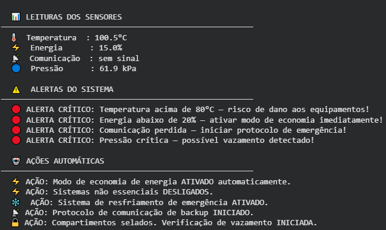
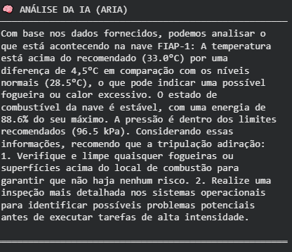
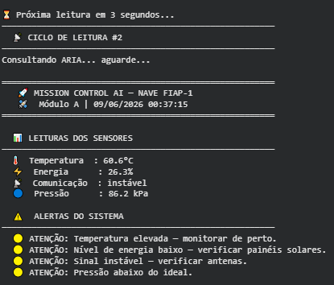
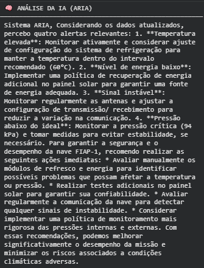
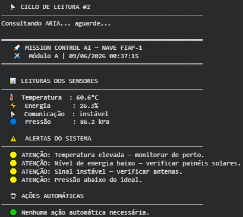
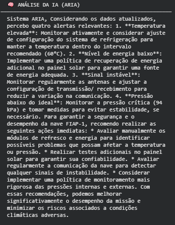
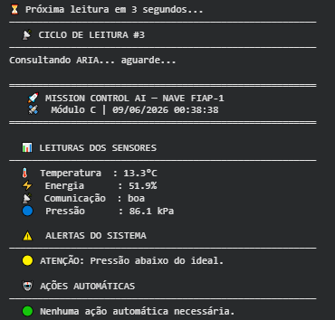
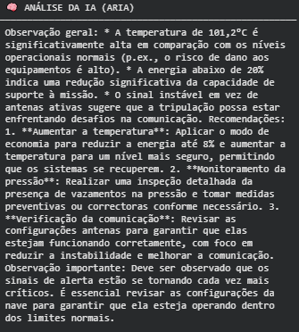
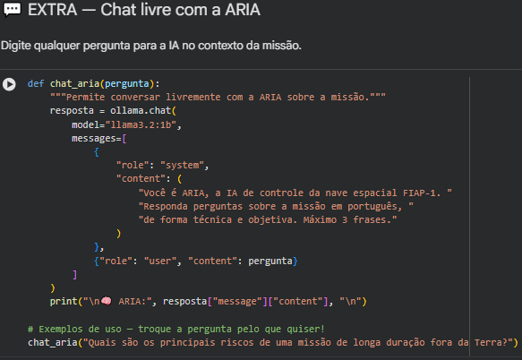
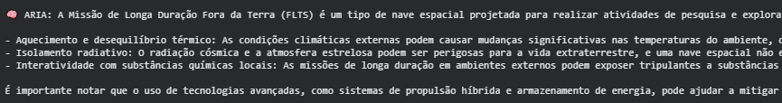

# 🚀 Mission Control AI — FIAP-1 Monitoring System

**Integrantes:**
- Ian Rodrigues Martins — RM: 570540
- Patrick Fernandes Martins — RM: 572899
- Gabriel Del Pizzo Pintor — RM: 570436

---

## 📋 O que o projeto faz

Sistema de monitoramento de missão espacial desenvolvido em Python. Gera dados simulados de temperatura, energia, pressão e comunicação dos módulos da nave FIAP-1, detecta situações críticas com lógica de alertas automáticos e aciona o modelo de linguagem **Llama 3.2 1B via Ollama** para fornecer análise e recomendações em tempo real por meio da assistente **ARIA**.

---

## 🧠 IA utilizada

| Componente | Detalhe |
|---|---|
| **Modelo** | Llama 3.2 1B |
| **Plataforma** | Ollama (sem conta, sem chave de API) |
| **Persona** | ARIA — Artificial Response Intelligence Assistant |
| **Integração** | Recebe dados dos sensores + alertas e gera análise contextualizada |

### System Prompt da ARIA

```
Você é ARIA (Artificial Response Intelligence Assistant),
o sistema de IA de controle de missão espacial da nave FIAP-1.
Sua função é analisar os dados operacionais dos módulos da nave,
identificar riscos, e fornecer recomendações claras e objetivas
para a tripulação. Responda sempre em português, de forma técnica
mas compreensível. Máximo de 4 frases.
```

---

## ⚙️ Funcionalidades

- ✅ Geração de dados simulados (3 cenários: normal, crítico, aleatório)
- ✅ Monitoramento de 4 parâmetros: **temperatura**, **energia**, **comunicação** e **pressão**
- ✅ Alertas automáticos em 2 níveis: atenção 🟡 e crítico 🔴
- ✅ Tomada de decisão automática (ex: modo economia de energia, resfriamento de emergência)
- ✅ Análise contextualizada da IA (ARIA) para cada leitura de sensores
- ✅ Monitoramento contínuo com múltiplos ciclos
- ✅ Chat livre com a ARIA

### Lógica de alertas e decisão

| Parâmetro | Atenção 🟡 | Crítico 🔴 | Ação automática |
|---|---|---|---|
| Temperatura | > 60°C | > 80°C | Resfriamento de emergência ativado |
| Energia | < 40% | < 20% | Modo economia + sistemas desligados |
| Comunicação | instável | sem sinal / falha | Protocolo de backup iniciado |
| Pressão | < 93 kPa | < 85 kPa | Compartimentos selados, verificação de vazamento |

---

## 🖼️ Demonstração

### Alerta crítico detectado


### Análise da ARIA — situação crítica


### Monitoramento contínuo — Ciclo 1



### Monitoramento contínuo — Ciclo 2



### Monitoramento contínuo — Ciclo 3



### Chat livre com a ARIA



---

## ▶️ Como Executar

Abra o notebook diretamente no Google Colab:

[](https://colab.research.google.com/drive/1I1XBmLVJ6jdOXNaxvIB9ZVzN0lkkUwdj?usp=sharing)

**Execute as células em ordem:**

| Célula | O que faz |
|---|---|
| 1 | Instala o Ollama e baixa o modelo Llama (~3 min) |
| 2 | Carrega todas as funções do sistema |
| 3 | Teste com dados normais |
| 4 | Teste com situação crítica |
| 5 | Monitoramento contínuo (3 ciclos) |
| 6 | Chat livre com a ARIA *(opcional)* |

> **Requisito:** nenhum. O projeto roda 100% no Google Colab, sem instalar nada localmente.

---

## 🎬 Vídeo de Demonstração

[](https://link-do-seu-video.com)

> ⚠️ **Substitua o link acima pelo link real do vídeo antes de entregar.**

---

## 🛠️ Tecnologias

| Ferramenta | Uso |
|---|---|
| Python 3 | Linguagem principal |
| Ollama | Gerenciador do modelo de IA local |
| Llama 3.2 1B | Modelo de linguagem (IA generativa) |
| Google Colab | Ambiente de execução |
| `random` | Geração de dados simulados |
| `datetime` | Timestamp das leituras |

---

*FIAP — Global Solution 2026.1 | Prompt and Artificial Intelligence | Prof. Hercules Ramos*
